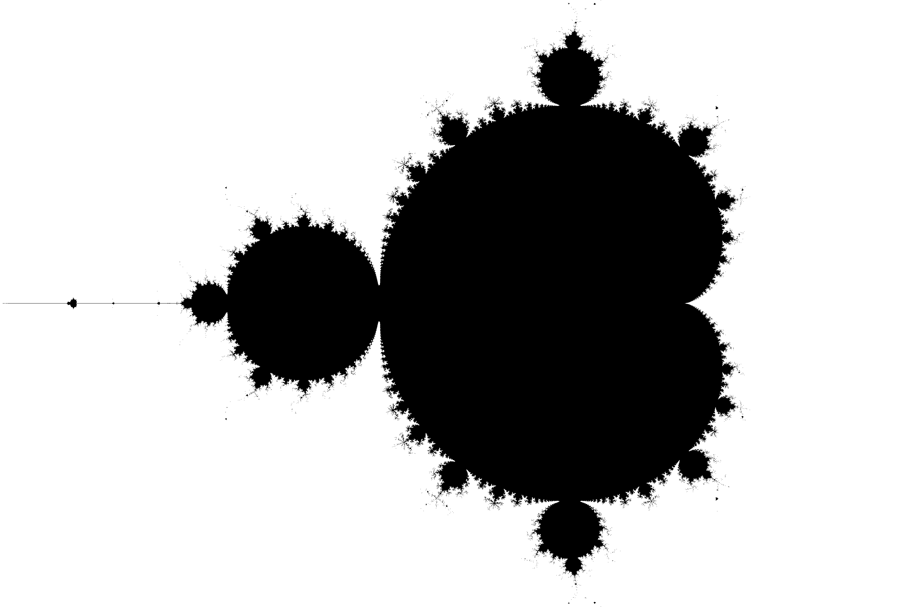
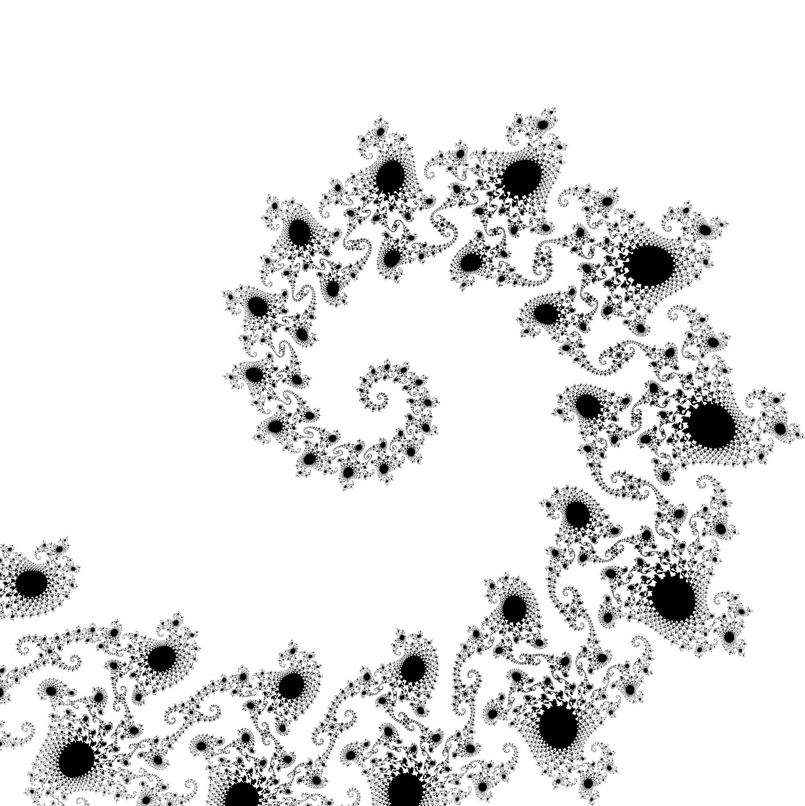

## Pyfractal

Pyfractal is a Python library which provides several function about the Mandelbrot and Julia sets. It enables you to create plots of the sets, exporting a PNG image.

## Installation

The following libraries are needed in order for Pyfractal to work : numpy, matplotlib.  //see with rémi the setup
If you want to run the tests, Pytest is also necessary.

Once you cloned the current Git repository, go where the file setup.py is located and run the following command  :
```
pip install .
``` 

## Usage

# In scripts

You can directly use the provided functions in your scripts, for instance if you want a default and a custom plot of the Mandelbrot set :
```
from pyfractal.mandelbrot import plot_mandelbrot
plot_mandelbrot() #default version
plot_mandelbrot(zmin=-0.7440+0.1305j,
                zmax=-0.7425+0.1320j,
                pixel_size=5e-7,
                max_iter=200,
                figname="Mandelbrot_tentacle.png") #custom version
``` 
This will export the two PNG image below in your current directory (one per function called) : "Mandelbrot.png" and "Mandelbrot_tentacle.png" :





Plotting the Julia set is basically the same logic, there is just an additional optional parameter (c, see documentation).

# In Commmand lines

You can get the same results using command lines, like below:
$ MandelbrotPlot -o "Mandelbrot.png"
$ MandelbrotPlot --zmin=-0.7440+0.1305j\
                --zmax=-0.7425+0.1320j \
                --pixel_size=5e-7\
                --max-iter=200\
                -o "Mandelbrot_tentacle.png"

To plot the Julia set, the command line is JuliaPlot.

## Documentation

The Documentation for Pyfractal is available in ./doc/build/html. Once you are in this folder, on can run the following line to access the full documentation on your navigator :

```
python3 -m http.server
``` 


